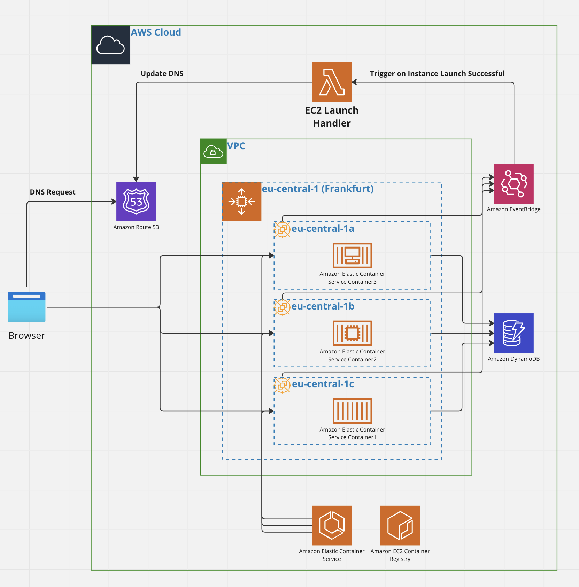

# EC2 Launch Handler

An AWS Lambda function that automatically updates Route53 DNS records when EC2 instances launch, designed specifically for applications running on Spot Instances.

## Overview

When running applications on EC2 Spot Instances, AWS can terminate them at any time when capacity is needed. When Auto Scaling launches replacement instances, they get new IP addresses. This Lambda function automatically updates your DNS records to point to the newly launched instance's public IP address.

## Why This Project?

While AWS offers production-ready solutions like Load Balancers and Elastic IPs, this project provides a cost-effective alternative for:
- Learning and experimentation with AWS serverless architecture
- Hobby projects and development environments
- Applications running on Spot Instances where cost optimization is prioritized

## How It Works

1. **EventBridge Trigger**: Listens for "EC2 Instance Launch Successful" events from Auto Scaling groups
2. **Instance Validation**: Fetches instance details and validates it belongs to your application using tag filtering
3. **DNS Update**: Automatically updates Route53 A records to point to the new instance's public IP address



## Project Structure

```
├── src/
│   ├── handlers/
│   │   ├── app.mjs              # Main Lambda handler
│   │   └── records.json         # DNS records configuration
│   ├── aws-clients/
│   │   ├── ec2client.mjs        # EC2 API interactions
│   │   └── route53client.mjs    # Route53 API interactions
│   ├── events/                  # Sample EventBridge events for testing
│   └── schema/                  # Event schema definitions
├── template.yaml                # AWS SAM template
└── package.json                 # Node.js dependencies
```

## Configuration

Before deploying, you'll need to configure:

1. **Route53 Hosted Zone**: Create or identify your hosted zone ID
2. **IAM Policy**: Create a Route53 management policy (referenced in template.yaml)
3. **DNS Records**: Update `src/handlers/records.json` with your domain names
4. **Tag Filter**: Set the tag value used to identify your application's instances

### Environment Variables

The Lambda function uses these environment variables (configured in template.yaml):
- `Region`: AWS region where your resources are located
- `HostedZoneId`: Route53 hosted zone ID for your domain
- `TagsFilter`: Tag value to identify instances belonging to your application

## Prerequisites

- [AWS SAM CLI](https://docs.aws.amazon.com/serverless-application-model/latest/developerguide/serverless-sam-cli-install.html)
- [Node.js 18](https://nodejs.org/en/) with npm
- [Docker](https://hub.docker.com/search/?type=edition&offering=community) (for local testing)
- AWS account with appropriate permissions

## Deployment

## Deployment

1. **Update Configuration Files**:
   - Edit `src/handlers/records.json` with your domain names
   - Update `template.yaml` parameters (Region, HostedZoneId, TagsFilter)
   - Ensure the IAM policy ARN in `template.yaml` matches your Route53 policy

2. **Build and Deploy**:

```bash
sam build
sam deploy --guided
```

During the guided deployment, you'll be prompted for:
- **Stack Name**: Unique name for your CloudFormation stack
- **AWS Region**: Target region for deployment
- **Confirm changes before deploy**: Review changes before applying
- **Allow SAM CLI IAM role creation**: Required for Lambda execution role
- **Save arguments to samconfig.toml**: Save configuration for future deployments

## Local Testing

## Local Testing

Build the application:

```bash
sam build
```

Test the function locally with a sample event:

```bash
sam local invoke EC2LaunchFunction --event src/events/instancelaunch.json
```

## Running Tests

Install dependencies and run unit tests:

```bash
npm install
npm run test
```

## Monitoring and Logs

View Lambda function logs:

```bash
sam logs -n EC2LaunchFunction --stack-name ec2-launch-handler --tail
```

## Cleanup

To delete the deployed application:

```bash
aws cloudformation delete-stack --stack-name ec2-launch-handler
```

## How the Lambda Function Works

1. **Event Reception**: Receives EventBridge event when Auto Scaling launches an EC2 instance
2. **Extract Instance ID**: Parses the instance ID from the event payload
3. **Fetch Instance Details**: Calls EC2 API to get public IP and tags
4. **Tag Validation**: Checks if instance tags match the configured `TagsFilter`
5. **Update DNS**: If validated, updates all Route53 A records with the new public IP
6. **Return Result**: Returns success/failure status with details

## AWS Services Used

- **AWS Lambda**: Serverless compute for event handling
- **Amazon EventBridge**: Event routing from Auto Scaling
- **Amazon EC2**: Instance metadata retrieval
- **Amazon Route53**: DNS record management
- **AWS Auto Scaling**: Triggers instance launch events

## Permissions Required

The Lambda function needs:
- `AWSLambdaBasicExecutionRole`: CloudWatch Logs access
- `AmazonEC2ReadOnlyAccess`: Read EC2 instance details
- Custom Route53 policy: Update DNS records in your hosted zone

## Resources

- [AWS SAM Developer Guide](https://docs.aws.amazon.com/serverless-application-model/latest/developerguide/what-is-sam.html)
- [AWS Lambda Documentation](https://docs.aws.amazon.com/lambda/)
- [Amazon Route53 Documentation](https://docs.aws.amazon.com/route53/)
- [EventBridge Documentation](https://docs.aws.amazon.com/eventbridge/)
